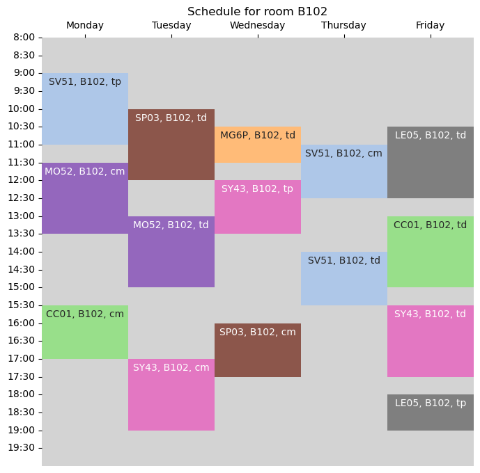

# AI50 - Time Table Scheduling

This project is a UE AI50 project at UTBM. Its aim is to create a timetable for UTBM.


## Table of Contents

- [Introduction](#introduction)
- [Features](#features)
- [Installation](#installation)
- [Usage](#usage)
- [Contributing](#contributing)
- [License](#license)

## Introduction

Time Table Scheduling is a category of Scheduling in which involves generating a formatted schedule for a particular
organization. For universities, timetable management is a complicated issue which uses up a great deal of human
resources and is therefore very costly hence the need for a more efficient approach. The goal of this project is to
automate the creation of an optimized university timetable for University of Technology of Belfort- Montbéliard (UTBM),
by considering the list of hard and soft constraints offered in a semester, so that no conflict is made in these
assignments. In order to achieve this aim, metaheuristics, such as population-based methods like genetic algorithms,
will be used.

## Features

- [ ] Create a timetable for a semester
- [ ] Take into account the constraints of the university
- [ ] Optimize the timetable
- [ ] Display the timetable
- [ ] Export the timetable in a PNG file, UVs timetable, teachers timetable, rooms timetable, students timetable
  

__Constraints :__

- [ ] One UV per room at a time
- [ ] Check if the room is available and capacity is enough
- [ ] One UV per teacher at a time

__Optimization :__

- [ ] Each student has the UV they want
- [ ] ...

## Installation

First, clone the repository to your local machine:

```bash
git clone https://github.com/thibault-chausson/AI50-TimeTableScheduling
```

Then, install the required packages:

```bash
pip install -r requirements.txt
```

Run project :

```bash
python main.py
```

## Usage

__Data :__

Download data file :

- promotions is a file with all students and their UVs wishes

```
[
    {
        "student_id": "9eebf1b2-6ea9-4067-b665-bed0ddc5d3b4",
        "name": "Student9eebf1b2-6ea9-4067-b665-bed0ddc5d3b4",
        "uvs": [
            "LG01",
            "MG01",
            "HT01",
            "MG07",
            "MG74",
            "UE1B"
        ]
    },
    ...
]
```

- UVs is a file with all UVs and their constraints

```
[
    {
        "code": "EC73",
        "name": "Economie niveau II",
        "credits": 1.0,
        "semester": "P",
        "rooms": [],
        "teachers": [
            "Philippe CICCONE"
        ],
        "cm": 600,
        "td": 600,
        "tp": 0,
        "capacity": 26
    },
    ...
]
```

- rooms is a file with all rooms and their constraints

```
{
    "E107": {
        "capacity": 117,
        "type": "AMPHI (vid\u00e9oprojecteur)",
        "description": "",
        "site": "Belfort"
    },
    ...
}
```

__Execution :__

- `get_instance` : create an instance of the problem, be careful the function creates a random promotion instance, as we
  don't yet have a promotion file
- all information in files `main.py` and `variables.py`

## Contributing

List of the main contributors of the project.

- CHAUSSON
  Thibault : [GitHub](https://github.com/thibault-chausson) - [LinkedIn](https://www.linkedin.com/in/thibault-chausson/)
- EL HAJ HISSEIN Olivier : [GitHub](https://github.com/OlivierElh)
- GUINOT
  Jossua : [GitHub](https://github.com/UnTabouret) - [LinkedIn](https://www.linkedin.com/in/jossua-guinot-283342176/)
- METALLAOUI Nassim : [GitHub](https://github.com/nassim-metall)
- VIGUIER Léo : [GitHub](https://github.com/LeoViguier) - [LinkedIn](https://www.linkedin.com/in/léo-viguier-aa42941b0/)

## License

Copyright © 01/07/2024, CHAUSSON Thibault, EL HAJ HISSEIN Olivier, GUINOT Jossua, METALLAOUI Nassim, VIGUIER Léo.

Permission is hereby granted, free of charge, to any person obtaining a copy of this software and associated
documentation files (the “Software”), to deal in the Software without restriction, including without limitation the
rights to use, copy, modify, merge, publish, distribute, sublicense, and/or sell copies of the Software, and to permit
persons to whom the Software is furnished to do so, subject to the following conditions:

The above copyright notice and this permission notice shall be included in all copies or substantial portions of the
Software.

The Software is provided “as is”, without warranty of any kind, express or implied, including but not limited to the
warranties of merchantability, fitness for a particular purpose and noninfringement. In no event shall the authors or
copyright holders X be liable for any claim, damages or other liability, whether in an action of contract, tort or
otherwise, arising from, out of or in connection with the software or the use or other dealings in the Software.

Except as contained in this notice, the name of the CHAUSSON Thibault, EL HAJ HISSEIN Olivier, GUINOT Jossua, METALLAOUI
Nassim, VIGUIER Léo shall not be used in advertising or otherwise to promote the sale, use or other dealings in this
Software without prior written authorization from the CHAUSSON Thibault, EL HAJ HISSEIN Olivier, GUINOT Jossua,
METALLAOUI Nassim, VIGUIER Léo.